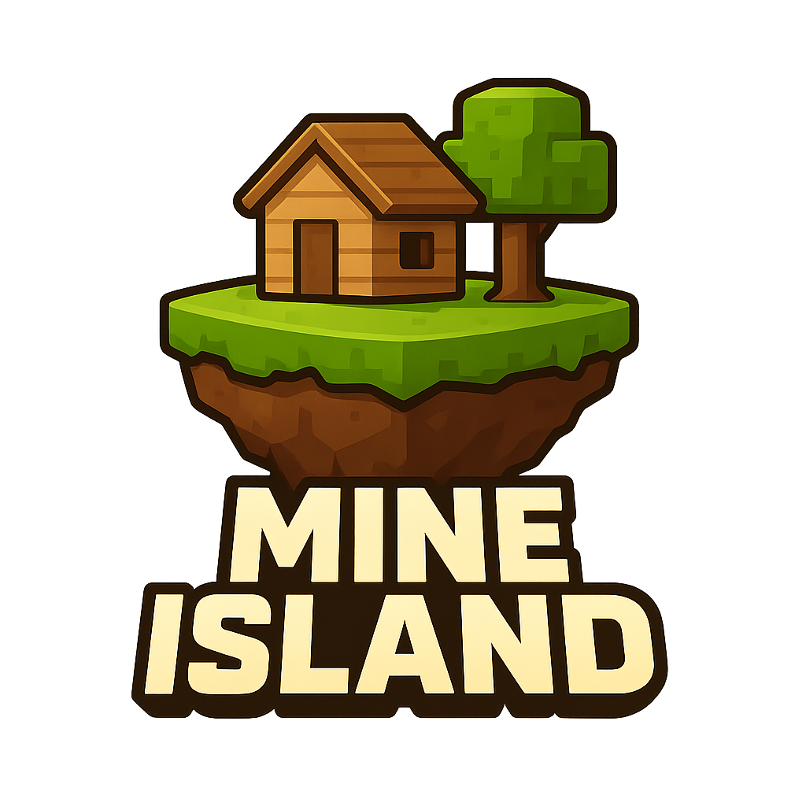

  

# 🌴 Mine Island

A survival-oriented Spigot plugin that provides players with their own personal floating islands, allowing them to build, expand, and create a private base in a safe environment.

## Overview

Mine Island gives each player a dedicated island in a separate `islands` world.  
Here, players can build their own base, expand their buildable area, and play without the fear of being griefed.

## Features

- **Personal Islands**: Each player receives their own island to build freely.  
- **Structured Land System**: Islands are divided into **100x100 slots** with a **90x90 buildable area** in the center.  
- **Zone Ownership**: Islands are further divided into **10x10 zones** (9x9 usable). Players start with the central zone and can expand gradually.  
- **Upgradeable Land**: Players can expand their islands by purchasing additional zone.  
- **Configurable Economy**: Set expansion prices and define multipliers for each purchase.  
- **Plugin Integration**: Supports [Vault](https://www.spigotmc.org/resources/vault.34315/) and [Essentials](https://essentialsx.net/) for full economy and utility functionality.  

### Expandable Mode

The **Expandable Mode** determines whether players can gradually unlock and purchase new zones on their island.

- When **enabled** (default), islands start with a single central zone, and players can expand their territory by purchasing additional zones as they progress.  
- When **disabled**, players automatically own the entire island from the start, with no expansion required.  
- This behavior is defined at the moment an island is created, based on the configuration settings in the plugin.

## Installation

### Prerequisites
- A Minecraft server running **Spigot**, **Paper**, or a compatible fork.  
- **Vault** plugin installed.  
- Java 21 or higher recommended.

### Steps
1. Download the latest `MineIsland.jar` from [SpigotMC](https://www.spigotmc.org/) or the GitHub releases page.  
2. Place the `.jar` file in your server's `plugins` folder.  
3. Restart the server to load the plugin.  
4. Customize settings in `settings.yml` as needed.  

## Commands and Permissions

The main command is: `/mineisland <args>`.  
An alias is also available: `/mi <args>`.

### SubCommands

| Command                | Description                                                                 | Permission                 |
|------------------------|-----------------------------------------------------------------------------|----------------------------|
| `/mineisland new`      | Allows players to create a new island.                                      | `mineisland.command.new`   |
| `/mineisland tp`       | Allows players to teleport to their island.                                 | `mineisland.command.tp`    |
| `/mineisland back`     | Allows players to return to the fallback world.                             | `mineisland.command.back`  |
| `/mineisland menu`     | Allows players to open the island management menu.                          | `mineisland.command.menu`  |
| `/mineisland setspawn` | Allows players to set their island's new spawn point.                       | `mineisland.command.setspawn` |
| `/mineisland help`     | Allows players to view help information.                                    | `mineisland.command.help`  |

### Other Permissions
- `mineisland.admin` – Grants full plugin access and bypasses island movement restrictions.

## Issues & Feature Requests

Found a bug or have an idea to improve the plugin? Please open an issue in the **GitHub Issues**

## Contributing

Contributions are welcome! If you’d like to improve the project, feel free to fork the repository and open a pull request.

## Credits

**Foundation Library** – Developed by **Kangarko (MineAcademy)**

## License

This project is licensed under the [MIT License](https://opensource.org/licenses/MIT).  

